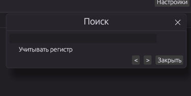

# edit

Редактор текста написаный на Rust с возможность поставить темную и светлую тему, поддерживает пользовательский css. может служить редактором кода

# Функции

Поиск
нумерация строк
красит синтаксис(пока работает плохо)
поддерживает дерево 
помогает писать код (закрывает скобки и тп)
вы можете поставить свой шрифт или выбрать из системных
есть быстрые горячие клавиши

## Структура проекта

```
edit-editor/
├── Cargo.toml            # зависимости + метаданные для cargo-deb
├── build.rs               # встраивает .ico в edit.exe на Windows
├── assets/
│   ├── icon.ico            # иконка Windows (мульти-разрешение)
│   └── icon.png            
├── src/
│   ├── main.rs             # точка входа, without console на Windows
│   ├── app.rs              # вся раскладка: заголовок, тулбар, вкладки, редактор
│   ├── theme.rs             # палитры: Light / Dark / Char
│   ├── custom_css.rs        # парсер CSS-переменных для своей темы
│   ├── settings.rs          # настройки, сохраняются в JSON
│   ├── syntax_highlight.rs  # подсветка синтаксиса (syntect) + подсветка поиска
│   ├── fonts.rs             # сканирование системных шрифтов
│   ├── file_tree.rs         # дерево файлов в сайдбаре
│   ├── search.rs             # состояние окна поиска
│   ├── editor_tab.rs         # одна открытая вкладка/файл
│   └── autoclose.rs          # автозакрытие скобок (без завязки на курсор egui)
├── installer/setup.iss     # Inno Setup: установщик Windows + регистрация типов файлов
├── linux/edit.desktop       # ярлык приложения для Ubuntu/GNOME
└── .github/workflows/build.yml  # CI: собирает .exe, установщик и .deb
```
# Preview


)
)
)


## Своя тема (CSS)

Настройки → Дополнительно → «Создать пример theme.css», либо создайте файл
самостоятельно:

```css
:root {
  --bg: #1e1e1e;
  --panel-bg: #252526;
  --titlebar-bg: #232121;
  --titlebar-fg: #e4e4e6;
  --sidebar-bg: #212122;
  --editor-bg: #1e1e1e;
  --fg: #d4d4d6;
  --fg-dim: #8a8a8f;
  --accent: #569cd6;
  --line-number: #5a5a5e;
  --selection: #264f78;
  --border: #333335;

  --font-family: Consolas;
  --font-size: 14;
}
```

Укажите путь к файлу в Настройках → Дополнительно, выберите тему «Своя (CSS)».

## Горячие клавиши

| Действие | Клавиши |
|---|---|
| Открыть файл | Ctrl+O |
| Открыть папку | Ctrl+Shift+O |
| Сохранить | Ctrl+S |
| Сохранить как | Ctrl+Shift+S |
| Новая вкладка | Ctrl+N |
| Закрыть вкладку | Ctrl+W |
| Поиск | Ctrl+F |
| Настройки | Ctrl+, |
| Полный экран | F11 |
