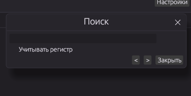

# edit

**edit** — быстрый текстовый редактор на Rust, который также можно использовать как редактор кода.

Поддерживает светлую и тёмную темы, пользовательские темы через CSS, дерево файлов, вкладки, подсветку синтаксиса, поиск и автоматическое закрытие скобок.

## Возможности

- Светлая и тёмная темы
- Пользовательская тема через CSS
- Дерево файлов
- Несколько вкладок
- Подсветка синтаксиса
- Подсветка результатов поиска
- Поиск по открытому файлу
- Нумерация строк
- Автоматическое закрытие скобок
- Выбор системного или пользовательского шрифта
- Быстрые клавиши
- Открытие файлов и папок
- Сборка для Windows и Linux

## Структура проекта

```text
edit/
├── Cargo.toml                         # манифест Cargo, зависимости и настройки сборки
├── build.rs                           # встраивание Windows-ресурсов и иконки в edit.exe
├── LICENSE                            # лицензия проекта
├── README.md                          # документация на русском
├── RU.md                         # документация на английском
│
├── assets/
│   ├── icon.ico                       # иконка Windows, несколько разрешений
│   ├── icon.png                       # основная иконка приложения
│   └── hicolor/                       # иконки Linux для разных размеров
│       ├── 16x16/apps/edit.png
│       ├── 24x24/apps/edit.png
│       ├── 32x32/apps/edit.png
│       ├── 48x48/apps/edit.png
│       ├── 64x64/apps/edit.png
│       ├── 128x128/apps/edit.png
│       ├── 256x256/apps/edit.png
│       └── 512x512/apps/edit.png
│
├── img/                                # изображения для документации
│   ├── image.png
│   ├── image(1).png
│   ├── image(2).png
│   └── image(3).png
│
├── src/
│   ├── main.rs                         # точка входа приложения
│   ├── app.rs                          # основной интерфейс: заголовок, панели, вкладки и редактор
│   ├── autoclose.rs                    # автоматическое закрытие скобок
│   ├── custom_css.rs                   # загрузка и разбор переменных пользовательской CSS-темы
│   ├── editor_tab.rs                   # состояние отдельной вкладки и открытого файла
│   ├── file_tree.rs                    # дерево файлов в боковой панели
│   ├── fonts.rs                        # поиск и работа с системными шрифтами
│   ├── i18n.rs                          # локализация интерфейса
│   ├── search.rs                       # состояние и логика поиска
│   ├── settings.rs                     # настройки приложения и их сохранение
│   ├── syntax_highlight.rs              # подсветка синтаксиса и результатов поиска
│   └── theme.rs                         # встроенные темы и их настройки
│
├── installer/
│   └── setup.iss                       # Inno Setup: установщик Windows и регистрация типов файлов
│
├── linux/
│   └── edit.desktop                    # desktop-файл для Linux/GNOME и других окружений
│
└── .github/
    └── workflows/
        └── build.yml                   # CI: автоматическая сборка релизных артефактов
```

### Иконки

Все платформенные варианты используют одну новую иконку приложения:

- `assets/icon.png` — основной PNG
- `assets/icon.ico` — Windows
- `assets/hicolor/*/apps/edit.png` — размеры для Linux

При изменении иконки рекомендуется обновлять весь набор, чтобы Windows, Linux и упаковщики использовали одинаковый внешний вид.

## Preview



.png)

.png)

.png)

## Своя тема (CSS)

Откройте **Настройки → Дополнительно → «Создать пример theme.css»** или создайте файл самостоятельно:

```css
:root {
  --bg: #1e1e1e;
  --panel-bg: #252526;
  --titlebar-bg: #232121;
  --titlebar-fg: #e4e4e6;
  --sidebar-bg: #212122;
  --editor-bg: #1e1e1e;
  --fg: #d4d4d6;
  --fg-dim: #8a8a8f;
  --accent: #569cd6;
  --line-number: #5a5a5e;
  --selection: #264f78;
  --border: #333335;

  --font-family: Consolas;
  --font-size: 14;
}
```

Укажите путь к файлу в **Настройки → Дополнительно** и выберите тему **«Своя (CSS)»**.

## Горячие клавиши

| Действие | Клавиши |
|---|---|
| Открыть файл | `Ctrl+O` |
| Открыть папку | `Ctrl+Shift+O` |
| Сохранить | `Ctrl+S` |
| Сохранить как | `Ctrl+Shift+S` |
| Новая вкладка | `Ctrl+N` |
| Закрыть вкладку | `Ctrl+W` |
| Поиск | `Ctrl+F` |
| Настройки | `Ctrl+,` |
| Полный экран | `F11` |

## Сборка

Проект собирается через Cargo:

```bash
cargo build --release
```

Для Windows `build.rs` автоматически встраивает `assets/icon.ico` в исполняемый файл.

Linux-сборка использует `linux/edit.desktop` и `assets/icon.png`; автоматическая упаковка выполняется через CI из `.github/workflows/build.yml`.

## Лицензия

См. файл [LICENSE](LICENSE).
